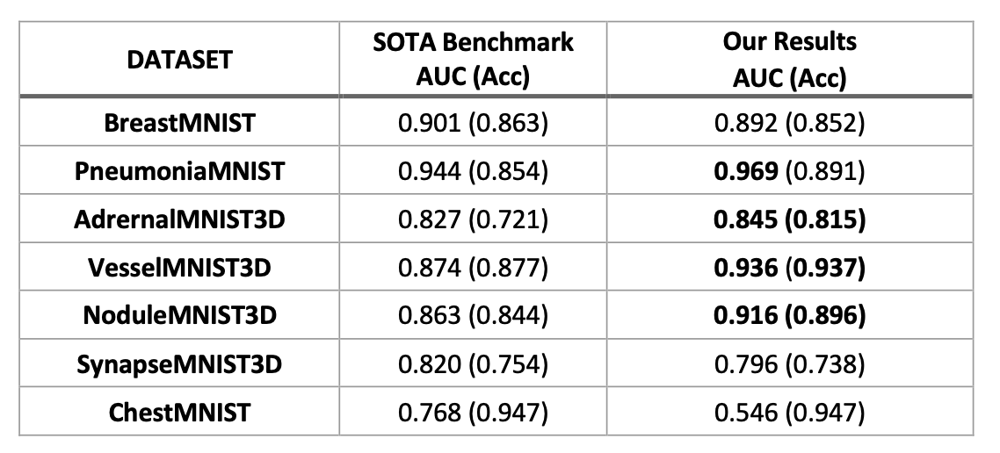

# Disease Recognition using Deep AUC Optimization

Deep AUC Maximization (DAM) is a powerful technique for training deep neural networks that involves optimizing the AUC score on a given dataset. While DAM has shown impressive results in medical image classification, it can be prone to overfitting on smaller datasets, leading to poor generalization performance. The goal of this project is to investigate ways to improve the generalization ability of DAM on medical image classification tasks.

It is a new paradigm for learning a deep neural network by maximizing the AUC score of the model on a dataset. It has broad range of applications, including training ChatGPT. In this project, we make use of Deep AUC Optimization to break the existing benchmark on MedMNIST datasets. Specifically, our work has been focused on the below datasets.

2D Datasets : 
- BreastMNIST 
- PneumoniaMNIST
- ChestMNIST  [Multiclass classification]

3D Datasets : 
- NoduleMNIST3D
- AdrenalMNIST3D
- VesselMNIST3D
- SynapseMNIST3D

Further details on the  dataset can be found at [MedMNIST dataset](https://medmnist.com/)

Combining the DAM paradigm with data augmentation and robust hyperparameter optimization, we were able to surpass the existing benchmark on 4 out of 7 datasets. Below are our results.

The project report provides a detailed explanation of our work.

Feel free to reach out @ [sneha.mishra@tamu.edu](mailto:sneha.mishra@tamu.edu).
